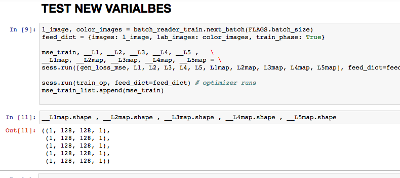

# HyperColumns of CNN and Image Colorization

#Website: [cerebrate.online](http://cerebrate.online)  
#Presentation: [bit.ly/cerebrateOnline](http://bit.ly/cerebrateOnline)  

# Introduction

Cerebrate was the project that I created during my time as a Data Engineering Fellow with Insight Data Science in early 2017.  The purpose of this three-week project was to build a pipeline that could ingest, process, and visualize large amounts of data.  

The main motivating case behind this project came from the area of disaster relief.  Imagine a large-scale disaster in the world that leaves 100,000,000 people without a stable food source.  A government could deploy a network of food centers (say, 100,000 of them) in an attempt to lend support, but will find themselves running into a massive logistics problem when centers run out of food and need to be resupplied.  

This is a application of a very abstract problem, which is an arbitrary network consisting of nodes distributed across a geometric space.  Each node has a stockpile of one or more resources, and receive requests from clients over time.  Additional resources are given to the nodes from outside sources, from their neighboring nodes, or from the clients themselves.  

Cerebrate is the first step towards allowing a user to deploy one of these arbitrary networks, configure it to their use case, and query it in ways that allow them to learn useful information about their network that they can base decisions off of.  My current set of features allows a user to track the demand (the rate at which requests for resources are coming in) and supply (the current level of resources) at a node on latencies on the order of about a second.  

# Pipeline

Most of this project is centered around Flink, which processes the streaming data.  Data is generated by a pair of Python scripts (one script to make requests to nodes, the other to supply them) and ingested by Kafka.  After reading and processing the stream, Flink sends the transformed data streams back to Kafka.  Kafka then hands the data to RethinkDB, which coordinates with Flask to form a front-end.  

# Data Generation

Input data to the Cerebrate pipeline consists a series of 2-tuples containing the vertex ID at which the event was generated and its associated timestamp.  The data is modeled as a Poisson process, which is a good first approximation to random event timings.  To make the data generation side more interesting, they can be configured to produce what I describe as sinusoidally-varying Poisson processes.  

In such a Poisson process, the parameter λ of the associated Poisson distribution is altered over time and follows a sine curve.  The period of the sine wave is configurable but initialized to 20 seconds.  The effect of this is that the rate at which requests are made at a node fluctuate with time.  

Two scripts are used here, one to simulate node requests and one to simulate node deposits.  These write to different Kafka topics.  Both currently produce about 25,000 events per second.  
