# HyperColumns of CNN and Image Colorization
This project is a revised version of https://arxiv.org/abs/1411.5752 and *much of these codes are based on*  https://tinyclouds.org/colorize/. 
- This project is to  illustrate hypercolumns and its usage in image colorization (which was proposed by Hypercolumns for Object Segmentation and Fine-grained Localization, Bharath Hariharan et al.)

- The project is different from the above two links in that it made trials and validated that a careful sampling of feature maps (i.e., a subset of feature maps) give comparable performance of using all feature maps, so as to reduce complexity.

## 1. Introduction
In this project, from the pre-trained VGG model "HyperColumns" is harvested and is used to colorize gray images.
The major target of this project is to explore HyperColumns and how it can be used in such computer vision tasks as image auto-colorizations. The training data is flower data set which is separated into train, validation and test sets. The trained model is also tested on images that are not from the flower data set. The project is done in Tensorflow 1.0 and Python.
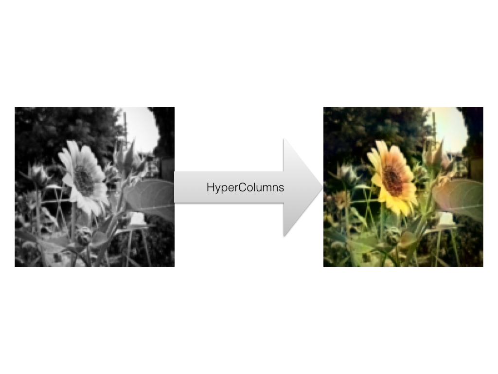

## 2. Task description

### 2.1 Background: LAB channels
A colorful image can be decomposed into three channels, such as RGB, LAB, HSL and HSV.  LAB is used in this project (https://en.wikipedia.org/wiki/Lab_color_space) where L means "lightness". L-channel representing a gray color image is the input of my model,  and the output is the predicted colorful image.
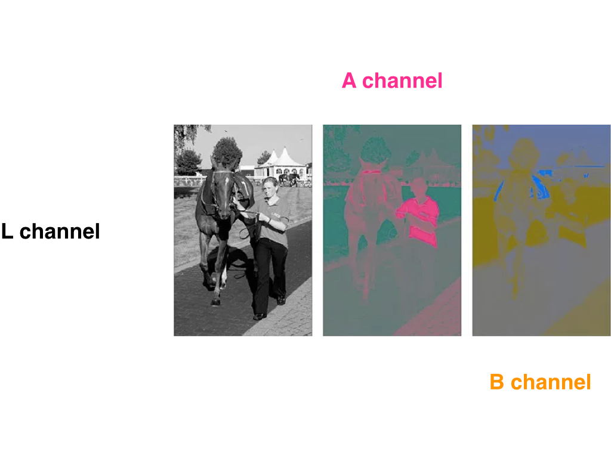

### 2.2 Does one channel contains all information of the other two channels ?
This is the first question many people would ask themselves at the very beginning. Me too. More specifically, does L channel contains all information of the A & B channels ? No. Then how can we recover A & B channels from L channel ?

The answer to this question leads to the usage of HyperColumns and a pre-trained convolutional neural network (CNN). In this project, pre-trained VGG is adopted and tweaked. VGG was trained on huge amount of images and it contains a lot of information regarding quite many of (if not all) objects in the world. Taking advantage of VGG, we should be able to colorize the gray images. VGG as "external information" is the essential reason why this colorization task can be done.
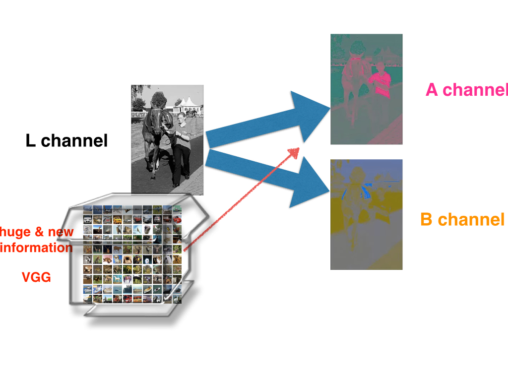

Making an analogy. Given three data points, we need to output a curve to fit them. There are tons of various curves that can fit these three data points. However, if somebody tells us (external information !) that the curve is most probably a quardratic curve, then we probably will produce the blue color curve.
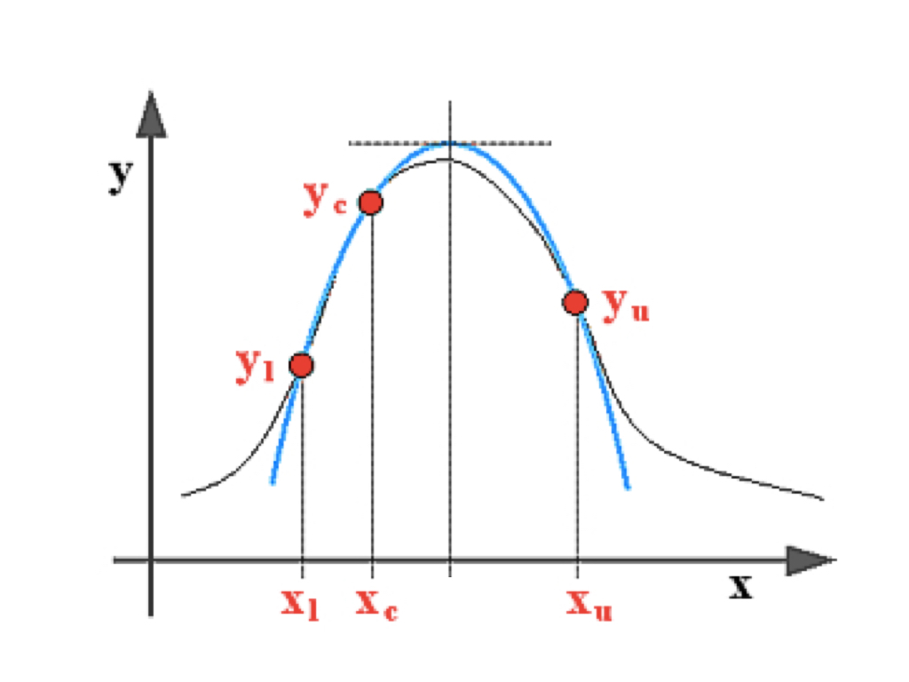
In order to harvest this external information that VGG has to provide, we need HyperColumns.

## 3. HyperColumns and VGG

Regarding CNN and VGG, refer to http://cs231n.github.io/convolutional-networks/

### 3.1 Load a pre-trained VGG

MODEL_URL = 'http://www.vlfeat.org/matconvnet/models/beta16/imagenet-vgg-verydeep-19.mat'

    def vgg_net(weights, image):
        layers = (
        'conv1_1', 'relu1_1',
        'conv1_2', 'relu1_2', 'pool1',

        'conv2_1', 'relu2_1', 'conv2_2', 'relu2_2', 'pool2',

        'conv3_1', 'relu3_1', 'conv3_2', 'relu3_2', 'conv3_3',
        'relu3_3', 'conv3_4', 'relu3_4', 'pool3',

        'conv4_1', 'relu4_1', 'conv4_2', 'relu4_2', 'conv4_3',
        'relu4_3', 'conv4_4', 'relu4_4', 'pool4',

        'conv5_1', 'relu5_1', 'conv5_2', 'relu5_2', 'conv5_3',
        'relu5_3', 'conv5_4', 'relu5_4'
    )

### 3.2 HyperColumns from VGG

The layers of a convolutional network is like as a non-linear counterpart of the image pyramids. The feature maps have different sizes. The topper they are on the VGG model, the smaller their sizes are. However, we need them to be of the same size, e.g., the size of the input grey image. Thus, the feature maps are upscaled by bilinear interpolation and are contatenated together to give us a "HyperColumn".  (It looks to me more like HyperMaps rather than HyperColumns though.)
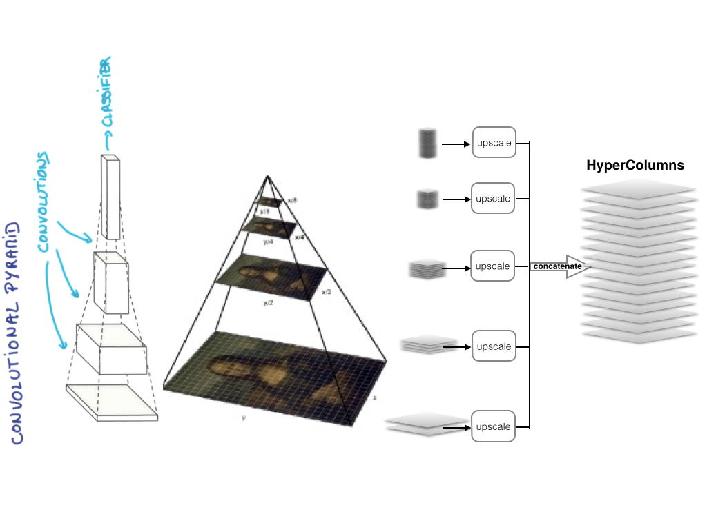

        relu1_2  = image_net["relu1_2"]
        layer_relu1_2 = tf.image.resize_bilinear(relu1_2, (IMAGE_SIZE, IMAGE_SIZE)) 

        relu2_1  = image_net["relu2_1"]
        layer_relu2_1 = tf.image.resize_bilinear(relu2_1, (IMAGE_SIZE, IMAGE_SIZE)) 
        
        relu2_2  = image_net["relu2_2"]
        layer_relu2_2 = tf.image.resize_bilinear(relu2_2, (IMAGE_SIZE, IMAGE_SIZE)) 

        relu3_1  = image_net["relu3_1"]
        layer_relu3_1 = tf.image.resize_bilinear(relu3_1, (IMAGE_SIZE, IMAGE_SIZE))         
        relu3_2  = image_net["relu3_2"]
        layer_relu3_2 = tf.image.resize_bilinear(relu3_2, (IMAGE_SIZE, IMAGE_SIZE)) 
        relu3_3  = image_net["relu3_3"]
        layer_relu3_3 = tf.image.resize_bilinear(relu3_3, (IMAGE_SIZE, IMAGE_SIZE)) 
        
        relu3_4  = image_net["relu3_4"]
        layer_relu3_4 = tf.image.resize_bilinear(relu3_4, (IMAGE_SIZE, IMAGE_SIZE))         
        relu4_1  = image_net["relu4_1"]
        layer_relu4_1 = tf.image.resize_bilinear(relu4_1, (IMAGE_SIZE, IMAGE_SIZE)) 
        relu4_2  = image_net["relu4_2"]
        layer_relu4_2 = tf.image.resize_bilinear(relu4_2, (IMAGE_SIZE, IMAGE_SIZE)) 
        relu4_3  = image_net["relu4_3"]
        layer_relu4_3 = tf.image.resize_bilinear(relu4_3, (IMAGE_SIZE, IMAGE_SIZE)) 
        relu4_4  = image_net["relu4_4"]
        layer_relu4_4 = tf.image.resize_bilinear(relu4_4, (IMAGE_SIZE, IMAGE_SIZE)) 
        
        relu5_1  = image_net["relu5_1"]
        layer_relu5_1 = tf.image.resize_bilinear(relu5_1, (IMAGE_SIZE, IMAGE_SIZE))         
        relu5_2  = image_net["relu5_2"]
        layer_relu5_2 = tf.image.resize_bilinear(relu5_2, (IMAGE_SIZE, IMAGE_SIZE))         
        relu5_3  = image_net["relu5_3"]
        layer_relu5_3 = tf.image.resize_bilinear(relu5_3, (IMAGE_SIZE, IMAGE_SIZE))         
        relu5_4  = image_net["relu5_4"]
        layer_relu5_4 = tf.image.resize_bilinear(relu5_4, (IMAGE_SIZE, IMAGE_SIZE))        
        
        HyperColumns = tf.concat([layer_relu1_2, \
                                     layer_relu2_1, layer_relu2_2, \
                                     layer_relu3_1, layer_relu3_2, layer_relu3_3, layer_relu3_4, \
                                     layer_relu4_1, layer_relu4_2, layer_relu4_3, layer_relu4_4, \
                                     layer_relu5_1, layer_relu5_2, layer_relu5_3, layer_relu5_4  \
                                    ] ,3)

### 3.3 Why call it HyperColumns ?
This terminology comes from neuroscience, where some part of our brain is called hypercolumn (refer to the paper link at the bottom). 

Here is a quick illustration from wiki: "A cortical column, also called hypercolumn, macrocolumn, functional column or sometimes cortical module, is a group of neurons in the cortex of the brain that can be successively penetrated by a probe inserted perpendicularly to the cortical surface, and which have nearly identical receptive fields."
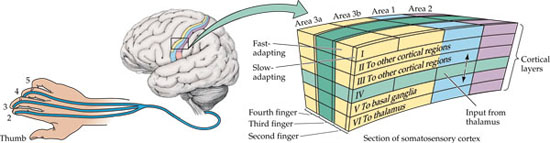

This analogy is quite similar to the feature maps of CNN.

## 4. Model
### 4.1 preprocess
Since gray color image contains only one channel, in order for VGG to be able to process it, the first convolutional filter of VGG is replaced with a new filter. This new filter takes into one channel tensor and then output 64-channels tensor which is then fed into the rest part of VGG.  

        W0 = utils.weight_variable([3, 3, 1, 64], name="W0")
        b0 = utils.bias_variable([64], name="b0")
        conv0 = utils.conv2d_basic(images, W0, b0)
        hrelu0 = tf.nn.relu(conv0, name="relu")
        image_net = vgg_net(weights, hrelu0)

### 4.2 Harvesting HyperColumns
Further and most importantly, the HyperColumns layer is added upon it, and then the HyperColumns are "squeezed" into a two-channels tensor which corresponds to the prediction of the A & B channels. 
Imagine a chopstick pushes through many slices of bread. It gives us many holes on the breads, and then all the holes comprise one HyperColumn which corresponds to one pixel of the original image.
This process is done by 1-by-1 convolution that "stiches" the feature maps together.

        HyperColumns = tf.concat([layer_relu1_2, \
                                     layer_relu2_1, layer_relu2_2, \
                                     layer_relu3_1, layer_relu3_2, layer_relu3_3, layer_relu3_4, \
                                     layer_relu4_1, layer_relu4_2, layer_relu4_3, layer_relu4_4, \
                                     layer_relu5_1, layer_relu5_2, layer_relu5_3, layer_relu5_4  \
                                    ] ,3)
        # wc1: Weights Combiner, 1-by-1 conv
        wc1 = utils.weight_variable([1, 1, 5440, 2], name="wc1")
        wc1_biase = utils.bias_variable([2], name="wc1_biase")
        pred_AB_conv = tf.nn.conv2d(HyperColumns, wc1, [1, 1, 1, 1], padding='SAME')
        pred_AB = tf.nn.bias_add(pred_AB_conv, wc1_biase)        
    return tf.concat(values=[images, pred_AB], axis=3,  name="pred_image")

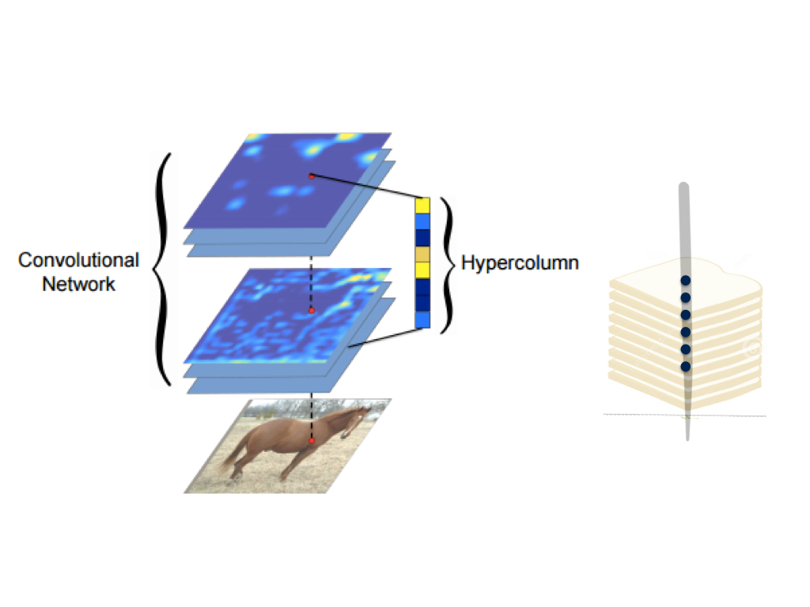

### 4.3 Training
We can see the progress that the model made during training (batch_size=10, learning rate=1e-4): 

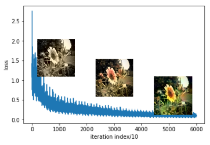

The model does not suit a traditional early stop strategy where the validation loss may give a U shape like this:

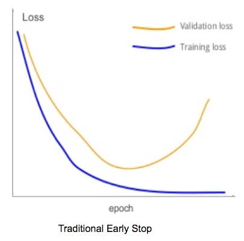

Instead, we can perform early stopping manually by checking the predicted the image. It is explicitly shown by the analogous figure below:

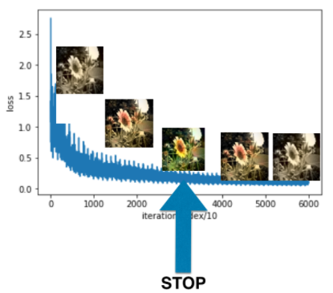

Why we do not use the traditional early stop ?  The major reason is that in here the validation loss is not U shape, but is L shape. More explaination is in the later section "Only Plausible".

### 4.4 Sampled results
Here are some sampled results. Some predicted images look as good as the orginal one. There are also failures, such as the bottom left, where the statue was given some pink color.

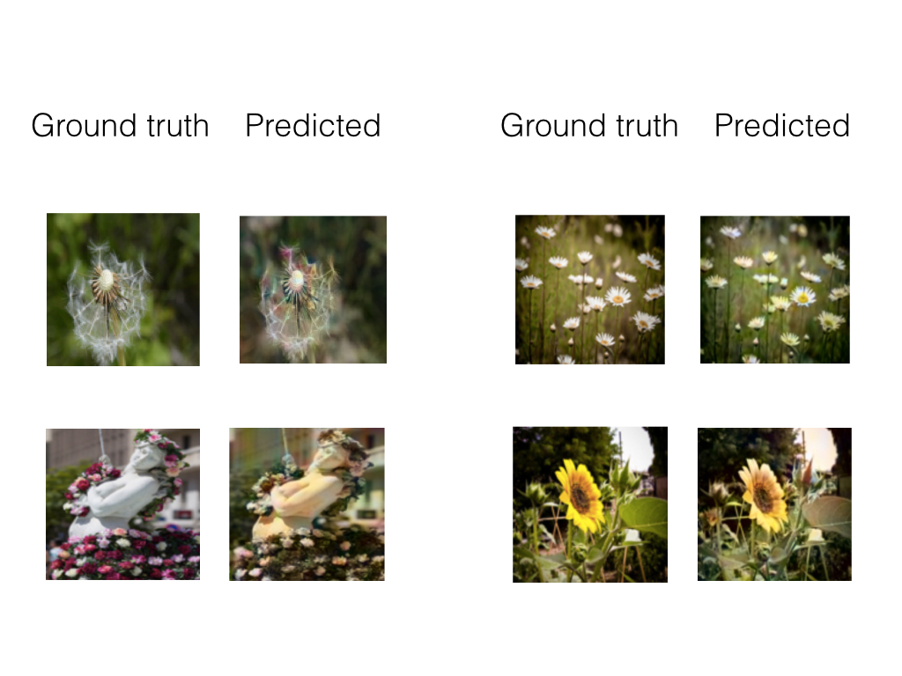
Applied the model on illustration pictures of old books, and here are some picked up good results (not all predictions are good since the model is not really trained on such kind of images):

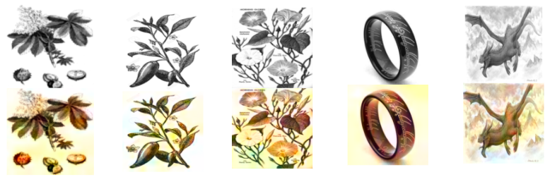

### 4.5 Tensorboard: how/which weights were updated during training 
Tensorboard allows us to peek into how the network weights (conv filters) change during training. Here shows some of the filters and biases:

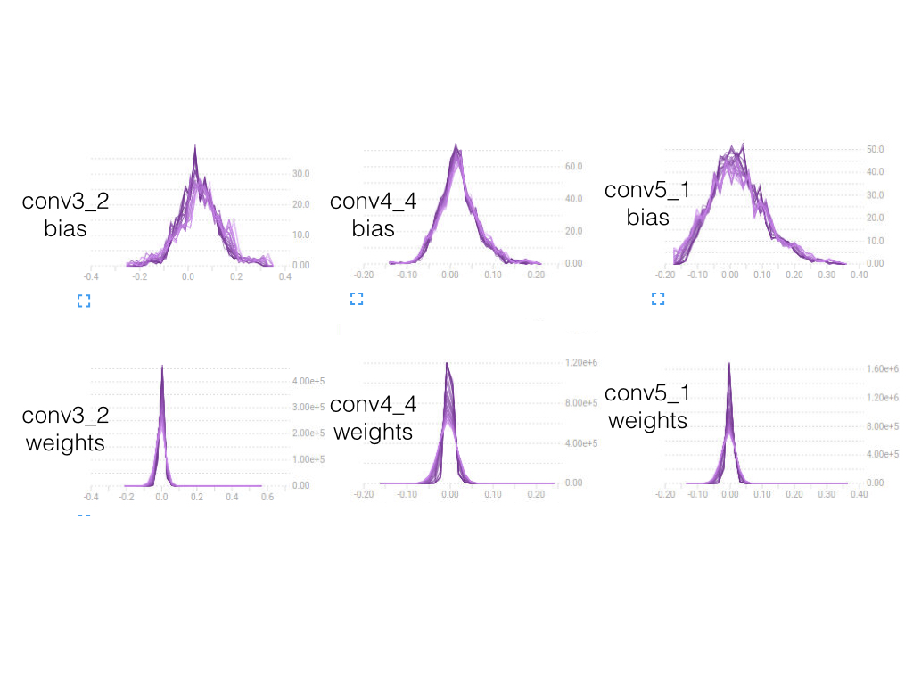

Actually all layers of filters have been updated to a considerable extent during the training. This indicates that all of the feature maps are useful and they probably contains different information. We should better incorporate all of the feature maps into our HyperColumns to avoid information loss.
That said, what if we only sample a portion of the feature maps ?

## 5. Simplified model
Instead of using all feature maps, simplified model only use a portion of them.

### 5.1 Simplified model, layers 1-4, after pooling

This simplified model picks up the output of the pooling of the first four layers of VGG, upscale them, and then concatenated them into a thinner HyperColumn. 

        wc1 = utils.weight_variable([1, 1, 960, 2], name="wc1")
        vgg_pool_1 = image_net["pool1"]
        vgg_pool_2 = image_net["pool2"]
        vgg_pool_3 = image_net["pool3"]
        vgg_pool_4 = image_net["pool4"]
         
        layer1 = tf.image.resize_bilinear(vgg_pool_1, (IMAGE_SIZE, IMAGE_SIZE))
        layer2 = tf.image.resize_bilinear(vgg_pool_2, (IMAGE_SIZE, IMAGE_SIZE))
        layer3 = tf.image.resize_bilinear(vgg_pool_3, (IMAGE_SIZE, IMAGE_SIZE))
        layer4 = tf.image.resize_bilinear(vgg_pool_4, (IMAGE_SIZE, IMAGE_SIZE))

        HyperColumns = tf.concat([layer1, layer2,layer3, layer4] ,3)        
        pred_AB_conv = tf.nn.conv2d(HyperColumns, wc1, [1, 1, 1, 1], padding='SAME')
        wc1_biase = utils.bias_variable([2], name="wc1_biase")
        pred_AB = tf.nn.bias_add(pred_AB_conv, wc1_biase)        
    return tf.concat(values=[images, pred_AB], axis=3,  name="pred_image")

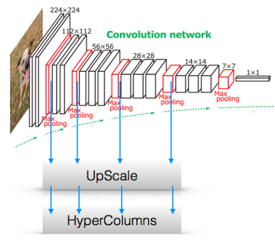

Apparently some information that VGG has to provied is lost, but this thinner model requests less computation and less memory. It is not powerful enough. Here are some samples of its predictions :

The predictions are not as good as the full model above, but still not very bad. 

Here is its training loss, which is larger than the full model above.

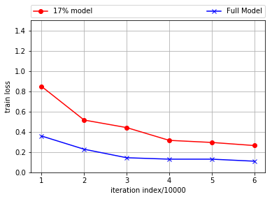

### 5.2 Simplified model, layers 1-5, before pooling
This simplified model picks up the output of ReLu (which means before pooling) of the first five layers (which means the top conv layer is included) of VGG. As earlier, they are upscaled and then concatenated into a thinner HyperColumns. Surprisingly, its performance is almost as good as the full model above.

        wc1 = utils.weight_variable([1, 1, 1472, 2], name="wc1")
        vgg_1 = image_net["relu1_2"]
        vgg_2 = image_net["relu2_2"]
        vgg_3 = image_net["relu3_4"]
        vgg_4 = image_net["relu4_4"]
        vgg_5 = image_net["relu5_4"]
         
        layer1 = tf.image.resize_bilinear(vgg_1, (IMAGE_SIZE, IMAGE_SIZE))
        layer2 = tf.image.resize_bilinear(vgg_2, (IMAGE_SIZE, IMAGE_SIZE))
        layer3 = tf.image.resize_bilinear(vgg_3, (IMAGE_SIZE, IMAGE_SIZE))
        layer4 = tf.image.resize_bilinear(vgg_4, (IMAGE_SIZE, IMAGE_SIZE))
        layer5 = tf.image.resize_bilinear(vgg_5, (IMAGE_SIZE, IMAGE_SIZE))

        HyperColumns = tf.concat([layer1, layer2,layer3, layer4, layer5] ,3)        
        pred_AB_conv = tf.nn.conv2d(HyperColumns, wc1, [1, 1, 1, 1], padding='SAME')
        wc1_biase = utils.bias_variable([2], name="wc1_biase")
        pred_AB = tf.nn.bias_add(pred_AB_conv, wc1_biase)        
    return tf.concat(values=[images, pred_AB], axis=3,  name="pred_image")

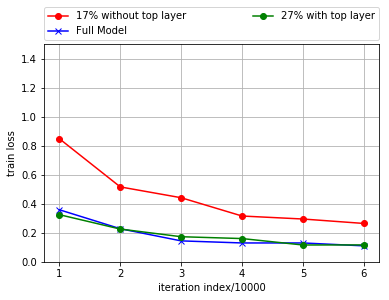

Some of its predictions are compared against the full model:

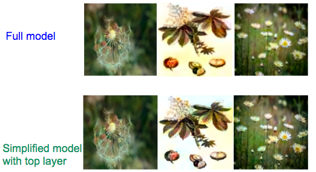

This result implies that the conv-layer-5 contains important information regarding color. Further, we should probably pick up feature map before pooling rather than after pooling, apparently. Pooling operation loses some information after all.

It may be interesting to try different combinations of layers, such as only the outputs of layers 1,2,3, or only the outputs of layeys 3,4,5, and so on. Is it possible that only some specific layers contribute most to the colorization task ?

I've tried :

* the ReLu output of the conv layers 3,4,5, and its performance is close to that of the full model. This is a very interesting signal that the higher conv layers are majorly useful for colorization. 
* the ReLu output of the conv layers 1 to 5, (64+128+256+512+512 feature maps) and it has given as good result as the full model (5440 feature maps). This is not very surprising and details are given later as below.
* the ReLu output of the conv layers 4 and 5, (512+512 feature maps) and the result is not very good. Probably this is because we have lost too much information by skiping layer 3.
* the ReLu output of the conv layer 5 only, (512 feature maps) and the result is not very good either.

Thus, it Looks that we need information distributed from all conv layers (or at least the higher conv layers).  Why ? It could be because : 

* Though the higher conv layer contains more feature maps (512 maps e.g.), its map size is too small (14-by-14, e.g.). On the other hand, though the lower layer provides larger feature map (224-by-224 e.g.), its number of featuer maps is too small (64 maps, e.g.)
Refer to http://cs231n.github.io/convolutional-networks/#case

* Different layer contains different information. Possibly the lowest layer contains little information regarding color (only hypothesis).
Refer to http://cs231n.github.io/understanding-cnn/

At last, I also tried harvesting feature maps & HyperColumns right after conv (i.e., before ReLu). It gives basically some same result as harvesting after ReLu (i.e., right before pooling).

### 5.3 Experimental Conclusions: 
* Need info from all the five conv layers (or at least the top conv layers)
* Should harvest feature map before pooling. It does not matter before ReLu or after ReLu, which is a a little bit surprising result. 
* Do not need all feature maps. Sampling is fine as long sampling the output of the layers (before pooling). -- Probably adjacent sub-layers in the same layer contain correlated information, and this is why we can sample the layers but avoid performance degrading.  Here is an analogy: in order to recover a sine wave, how many samples we need, 1000 or 100? The performance (recover error) of 1000 samples is almost the same as the performance of 100 samples because the samples that are very close to each other give similar information.

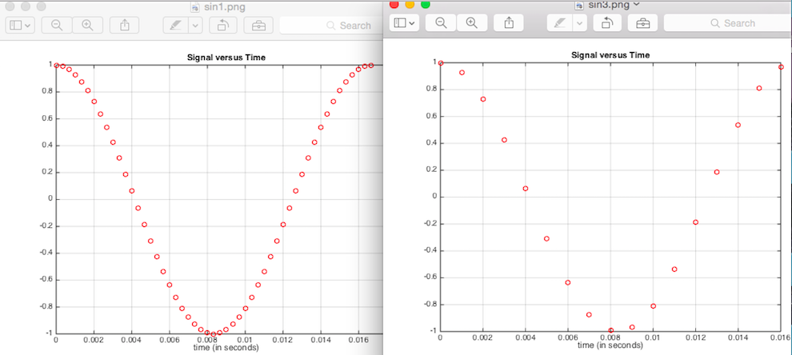

* On the other hand, different layers (e.g., layer 4 and layer 5) may be quite different, due to the pooling operation between them (there is no pooling between sublayers within the same layer). 
* Eventually, it is possible that sampled model (i.e., simplified model) may not perform well on huge amount of dataset, e.g., 1000 categories of 1.2 Million images. Huge amount of data and large number of categories of data may request a powerful model to handle. It is possible that a sampled model performs as well as the full model only because the amount of data and the number of categories of data are relatively small in this project.-- If this is true, the idea of  simplifyng model is still very useful, especially when we only need work on some specific type of data, e.g., predicting color for all the cartoon books from the same author. This means we can make a smart phone App to convert cartoons into colorful, but slightly different models for different authors. Each model runs much faster than the full model so as to give better user experience.

## 6. Other models I tried
### 6.1 more conv and non-linearity
I come up with some model based on the concept of HyperColumns. It tries to introduce more capacity and non-linearity, but did not give better performance. Anyway, here are what I've tried. Basically the feature maps from the same layer of VGG are concatenated together to give a layer-based-HyperColumns. Each layer-based-HyperColumns is "squeezed" by 1by1 conv into a single feature map. At last, these five feature maps go through non linear function ReLu respectively, are concatenated into one HyperColumns, and are used to make prediction. 

It is worth to try, because it gives some insights. It looks that the original feature maps of VGG already contains enough information. Redundant functions or capacities are not really requested. 

### 6.2 Residual
I actually also tried residual model as proposed by some others, but it only gives as good performance as sampling all conv layers. It looks that a reasonable sampling of the feature maps across all conv layers already contain enough information in order to recover the color. Fancier design is not really needed.

## 7. Only Plausible
The task is actually "hallucinating a plausible color version of the photograph". The reconstructed color may not be the same as or even close to the ground truth, but it is plausible.
Here are some examples:

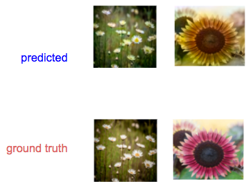

The color of the reconstruction is different from that of groundtruth. However, the reconstruction looks fine (plausible).  This means that the validation or test loss may be larger than expected, even if the model has been trained very well. In the experiments, the model gives L shape validation loss, where the loss is considerable larger than train loss which is reasonable apparently.  Further, the validation loss vibrates (goes up and down randomly) after the model has been trained well, majorly because the model may match ground truth on some images but may not on other images. Thus, traditional early stop does not work. The manual early stop method has been described in the "Training" section above.

Actually, there is no way to tell what is the true color of the ground truth. A sunflower may be yellow, but also could be purple. The grass could be green in summer, but yellow in winter. This is why the validation loss could be always large, and L shape. 

Even for human, given a gray photo we could make mistake when we hallucinate its color compared against ground truth. 
We probably give sunflower a yellow color, only because most sunflowers we've seen are yellow. The same with machine. The machine has been trained on mostly yellow sunflowers. Thus, the machine gives it a yellow color. This indicates that the machine may do a good job on the same type of data that it has been trained on. 

What if we apply the model on some image set that it has never seen, such as, cartoons ?
I did apply the model on cartoons, and it did not give a satisfying result. This is what is expected because the model has never been trained on cartoons. What if we have enough training data set of cartoons ? It will be interesting to see if it can colorize the cartoons from the same author. After all, an author usually presents a consistent style of art of herself/himself.

# useful linkes
## github or posts
* [Colorful Image Colorization](http://richzhang.github.io/colorization/) 
* [Automatic Colorization](http://tinyclouds.org/colorize/) 
* [Image colorization](https://github.com/shekkizh) 

## papers
* [Hypercolumns for Object Segmentation and Fine-grained Localization](https://arxiv.org/abs/1411.5752) - Bharath Hariharan, et. al.
* [Learning Representations for Automatic Colorization](https://arxiv.org/pdf/1603.06668.pdf) - Gustav Larsson, et. al.
* [Colorful Image Colorization](https://arxiv.org/pdf/1603.08511.pdf) - Richard Zang et. al.
