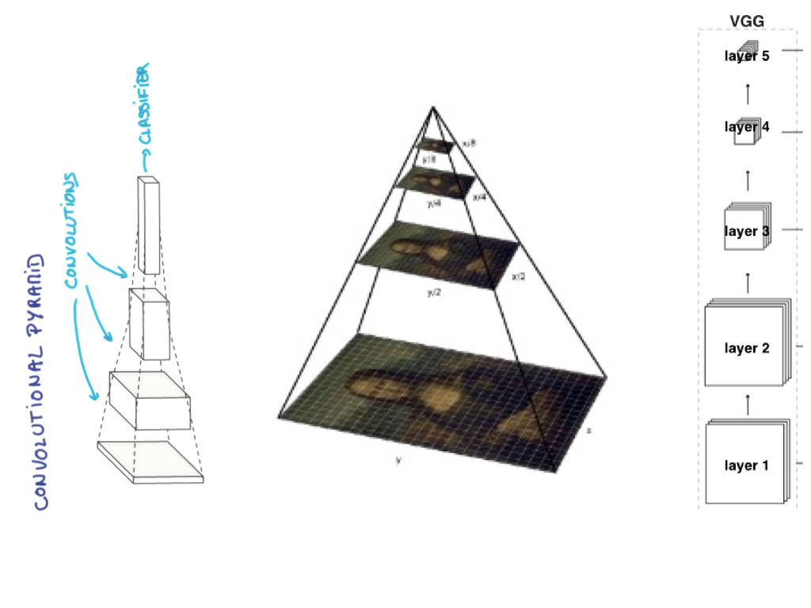

# HyperColumns of CNN and Image Colorization

## Introduction
HyperColumnsImageColorization was the project that I created during my time as a Artifitial Intelligence Fellow with Insight Data Science in early 2017. In this project, from the pre-trained VGG model "HyperColumns" was harvested and was used to colourize the black-and-white images.
The major target of this project is to explore HyperColumns and how it can be used in such computer vision tasks as image auto-colorizations. The training data was flower data set which was separated into train, validation and test sets. The trained model was also tested on images that are not from the flower data set, e.g., illustration pictures from books.

## Task description
A colorful image can be decomposed into three channels, such as RGB, LAB, HSL and HSV and so on.  LAB was used in this project (https://en.wikipedia.org/wiki/Lab_color_space) where L means "lightness". L-channel is the input as a gray color image, and the output will be the predicted colorful image.

Given only one channel which is corresponds to lightness or a gray color image, we are able to output a prediction of colorful image if we can recover the other two channels.

## Does one channel contains all information of the other two channels ?
This is the first question many people would ask themselves at the very beginning. More specifically, does L channel contains all information of the A & B channels ? If not, how can we recover the other A channel  and B channel from L channel ?
The answer to this question leads to the illustration of HyperColumns which can come from a pre-trained convolutional neural network (CNN) model. In this project, pre-trained VGG was adopted and tweaked. VGG was trained on huge amount of images and it contains a lot of information regarding quite many of (if not all) objects in the world. Taking advantage of VGG, we should be able to colorize the gray images. VGG as an external information contained is the essential reason why the task can be done.

Making an analogy. Given three data points, we need to output a curve to fit them. There are tons of various curves that can fit these three data points. However, what if somebody tells us (external information !) that the curve is most probably a quardratic curve ? We will produce the blue color curve.

What is HyperColumns ?
## HyperColumns
The layers of a convolutional network is like as a non-linear counterpart of the image pyramids. The feature maps have different sizes. The topper they are on the VGG model, the smaller their sizes are. We need them to be of the same size, i.e., the same as the size of the input gray image. Thus, the feature maps are upscaled by bilinear interpolation. Eventually, these upscaled feature maps are contatenated together to give us a HyperColumn. 

### Why call it HyperColumns ?
Looks like the author of the paper adopted this terminology from the idea of neuroscience, cortical column. 

Hariharan, Bharath, et al. "Hypercolumns for object segmentation and fine-grained localization." Proceedings of the IEEE Conference on Computer Vision and Pattern Recognition. 2015.

Here is a quick illustration from wiki: "A cortical column, also called hypercolumn, macrocolumn, functional column or sometimes cortical module, is a group of neurons in the cortex of the brain that can be successively penetrated by a probe inserted perpendicularly to the cortical surface, and which have nearly identical receptive fields."

## Model
Since gray color image contains only one channel, in order for VGG to be able to process one channel image, the first convolutional filter of pre-trained VGG was replaced with a new filter. This new filter takes in one channel tensor and then output 64-channels tensor so that the rest part of VGG can continue process it.  
Further and most importantly, a new model was added upon it. This new model consists of the harvest of the HyperColumns from VGG, also it "squeezes" the HyperColumns into a two-channels tensor which correspond to the prediction of the A channel and B channel. This process was done by 1-by-1 convolution that "stiches" the feature maps in the HyperColumns together.

Imagine the feature maps 

