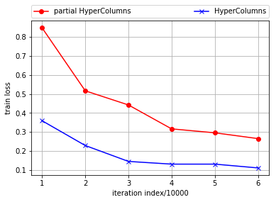
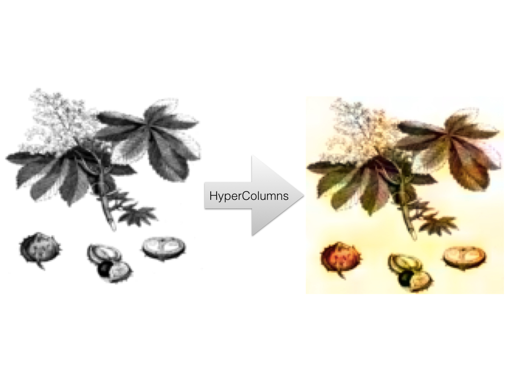

# HyperColumns of CNN and Image Colorization

## Introduction
HyperColumnsImageColorization was the project that I created during my time as a Artifitial Intelligence Fellow with Insight Data Science in early 2017. In this project, from the pre-trained VGG model "HyperColumns" was harvested and was used to colorize gray images.
The major target of this project is to explore HyperColumns and how it can be used in such computer vision tasks as image auto-colorizations. The training data was flower data set which was separated into train, validation and test sets. The trained model was also tested on images that are not from the flower data set. The project was done using Tensorflow 1.0.1.

## Task description
A colorful image can be decomposed into three channels, such as RGB, LAB, HSL and HSV.  LAB was used in this project (https://en.wikipedia.org/wiki/Lab_color_space) where L means "lightness". L-channel representing a gray color image is the the input of my model,  and the output is the predicted colorful image.

### Does one channel contains all information of the other two channels ?
This is the first question many people would ask themselves at the very beginning. Me too. More specifically, does L channel contains all information of the A & B channels ? No. Then how can we recover A & B channels from L channel ?

The answer to this question leads to the usage of HyperColumns and a pre-trained convolutional neural network (CNN). In this project, pre-trained VGG was adopted and tweaked. VGG was trained on huge amount of images and it contains a lot of information regarding quite many of (if not all) objects in the world. Taking advantage of VGG, we should be able to colorize the gray images. VGG as "external information" is the essential reason why this colorization task can be done.

Making an analogy. Given three data points, we need to output a curve to fit them. There are tons of various curves that can fit these three data points. However, if somebody tells us (external information !) that the curve is most probably a quardratic curve, then we probably will produce the blue color curve.

In order to harvest this external information that VGG has to provide, we need HyperColumns.

## HyperColumns
The layers of a convolutional network is like as a non-linear counterpart of the image pyramids. The feature maps have different sizes. The topper they are on the VGG model, the smaller their sizes are. However, we need them to be of the same size, e.g., the size of the input gray image. Thus, the feature maps are upscaled by bilinear interpolation. Eventually, these upscaled feature maps are contatenated together to give us a HyperColumn. 

        relu1_2  = image_net["relu1_2"]
        layer_relu1_2 = tf.image.resize_bilinear(relu1_2, (IMAGE_SIZE, IMAGE_SIZE)) 

        relu2_1  = image_net["relu2_1"]
        layer_relu2_1 = tf.image.resize_bilinear(relu2_1, (IMAGE_SIZE, IMAGE_SIZE)) 
        
        relu2_2  = image_net["relu2_2"]
        layer_relu2_2 = tf.image.resize_bilinear(relu2_2, (IMAGE_SIZE, IMAGE_SIZE)) 

        relu3_1  = image_net["relu3_1"]
        layer_relu3_1 = tf.image.resize_bilinear(relu3_1, (IMAGE_SIZE, IMAGE_SIZE))         
        relu3_2  = image_net["relu3_2"]
        layer_relu3_2 = tf.image.resize_bilinear(relu3_2, (IMAGE_SIZE, IMAGE_SIZE)) 
        relu3_3  = image_net["relu3_3"]
        layer_relu3_3 = tf.image.resize_bilinear(relu3_3, (IMAGE_SIZE, IMAGE_SIZE)) 
        
        relu3_4  = image_net["relu3_4"]
        layer_relu3_4 = tf.image.resize_bilinear(relu3_4, (IMAGE_SIZE, IMAGE_SIZE))         
        relu4_1  = image_net["relu4_1"]
        layer_relu4_1 = tf.image.resize_bilinear(relu4_1, (IMAGE_SIZE, IMAGE_SIZE)) 
        relu4_2  = image_net["relu4_2"]
        layer_relu4_2 = tf.image.resize_bilinear(relu4_2, (IMAGE_SIZE, IMAGE_SIZE)) 
        relu4_3  = image_net["relu4_3"]
        layer_relu4_3 = tf.image.resize_bilinear(relu4_3, (IMAGE_SIZE, IMAGE_SIZE)) 
        relu4_4  = image_net["relu4_4"]
        layer_relu4_4 = tf.image.resize_bilinear(relu4_4, (IMAGE_SIZE, IMAGE_SIZE)) 
        
        relu5_1  = image_net["relu5_1"]
        layer_relu5_1 = tf.image.resize_bilinear(relu5_1, (IMAGE_SIZE, IMAGE_SIZE))         
        relu5_2  = image_net["relu5_2"]
        layer_relu5_2 = tf.image.resize_bilinear(relu5_2, (IMAGE_SIZE, IMAGE_SIZE))         
        relu5_3  = image_net["relu5_3"]
        layer_relu5_3 = tf.image.resize_bilinear(relu5_3, (IMAGE_SIZE, IMAGE_SIZE))         
        relu5_4  = image_net["relu5_4"]
        layer_relu5_4 = tf.image.resize_bilinear(relu5_4, (IMAGE_SIZE, IMAGE_SIZE))        
        
        HyperColumns = tf.concat([layer_relu1_2, \
                                     layer_relu2_1, layer_relu2_2, \
                                     layer_relu3_1, layer_relu3_2, layer_relu3_3, layer_relu3_4, \
                                     layer_relu4_1, layer_relu4_2, layer_relu4_3, layer_relu4_4, \
                                     layer_relu5_1, layer_relu5_2, layer_relu5_3, layer_relu5_4  \
                                    ] ,3)

### Why call it HyperColumns ?
Looks like the author of the original paper adopted this terminology from some idea of neuroscience, where some part of our brain is called cortical column or hypercolumn. 

"Hariharan, Bharath, et al. "Hypercolumns for object segmentation and fine-grained localization." Proceedings of the IEEE Conference on Computer Vision and Pattern Recognition. 2015."

Here is a quick illustration from wiki: "A cortical column, also called hypercolumn, macrocolumn, functional column or sometimes cortical module, is a group of neurons in the cortex of the brain that can be successively penetrated by a probe inserted perpendicularly to the cortical surface, and which have nearly identical receptive fields."

This analogy is quite similar to the feature maps of CNN model.

## Model
Since gray color image contains only one channel, in order for VGG to be able to process it, the first convolutional filter of VGG was replaced with a new filter. This new filter takes in one channel tensor and then output 64-channels tensor which is fed into the rest part of VGG.  

        W0 = utils.weight_variable([3, 3, 1, 64], name="W0")
        b0 = utils.bias_variable([64], name="b0")
        conv0 = utils.conv2d_basic(images, W0, b0)
        hrelu0 = tf.nn.relu(conv0, name="relu")
        image_net = vgg_net(weights, hrelu0)

Further and most importantly, the HyperColumns layer was added upon it, and then the HyperColumns are "squeezed" into a two-channels tensor which correspond to the prediction of the A & B channels. 
Imagine a chopstick is pushed through many slices of bread and get many holes, then all the holes comprise one hypercolumn, and it corresponds to one pixel of the original image.
This process was done by 1-by-1 convolution that "stiches" the feature maps in the HyperColumns together.

        HyperColumns = tf.concat([layer_relu1_2, \
                                     layer_relu2_1, layer_relu2_2, \
                                     layer_relu3_1, layer_relu3_2, layer_relu3_3, layer_relu3_4, \
                                     layer_relu4_1, layer_relu4_2, layer_relu4_3, layer_relu4_4, \
                                     layer_relu5_1, layer_relu5_2, layer_relu5_3, layer_relu5_4  \
                                    ] ,3)
        # wc1: Weights Combiner, 1-by-1 conv
        wc1 = utils.weight_variable([1, 1, 5440, 2], name="wc1")
        wc1_biase = utils.bias_variable([2], name="wc1_biase")
        pred_AB_conv = tf.nn.conv2d(HyperColumns, wc1, [1, 1, 1, 1], padding='SAME')
        pred_AB = tf.nn.bias_add(pred_AB_conv, wc1_biase)        
    return tf.concat(values=[images, pred_AB], axis=3,  name="pred_image")

### Sampled results
Here are some sampled results. Some predicted image (top right) looks even better than the orginal one. There are also sort of failures, such as the bottom left, where the statue was given some pink color.

Further, we can see the progress that the model made during training: 

### Tensorboard: how/which weights were updated during training 
Tensorboard allows us to peek into how the network weights (conv filters) change during training. Here shows some of the filters and biases:

Actually all filters and biases were updated to considerable extent during training. That is, all of the layers of VGG had been considerably updated. This indicates that all of the feature maps are useful and they probably contains different information. None of them should be skipped. We should better incorporate all of the feature maps into our HyperColumns to avoid information loss.
That said, what if we only sample a portion of the feature maps ?

## Simplified model
I only picked up the output of each pool layer of VGG, upscale them, and then concatenated them into a thinner HyperColumn. Apparently some information that VGG has to provied was lost, but this thinner model requests less computation and memory to train. It is not powerful enough, and it yielded somewhat worse result like this:

## Yet another model..
I came up a model by myself based on the concept of HyperColumns, but it did not work well. 
The idea is to introduce more non-linearity into the network. Basically I took the feature maps from the same layer of VGG, concatenated them together to make a layer-based-HyperColumns, each of which was "squeezed" by 1by1 conv into a single feature map. At last, these five feature maps went through non linear function ReLu, concatenated into a HyperColumns, and at last this 5-layer-HyperColumns was used to make prediction as earlier model.

Without ReLu functions, this model will be equivalent to the full HyperColumns model illustrated earlier.

Here is the results... Not good.

## More...
Here is an illustration picture collected from an old book. The picture apparently is a gray image drawn many many years ago. Applying the model onto this picture, I got some result not too shaby:

Then apply the model on cartoon, and it did not give a satisfying result. This is what I had expected because the model was never trained on cartoons.

If the model is trained on a specific dataset, it might be able to do a fine job on the same type of data. What if I have enough training data set of cartoons ? It will be interesting to see if it can colorize the cartoons from the same author, given that a author may have a consistent style of art.
I will be extremely excited if I can get something like this:

😄

# useful linkes
## github or posts
* [Colorful Image Colorization](http://richzhang.github.io/colorization/) 
* [Automatic Colorization](http://tinyclouds.org/colorize/) 
* [Image colorization using CNNs in tensorflow](https://github.com/shekkizh) 

## papers
* [Hypercolumns for Object Segmentation and Fine-grained Localization](https://arxiv.org/abs/1411.5752) - Bharath Hariharan, et. al.
* [Learning Representations for Automatic Colorization](https://arxiv.org/pdf/1603.06668.pdf) - Gustav Larsson, et. al.
* [Colorful Image Colorization](https://arxiv.org/pdf/1603.08511.pdf) - Richard Zang et. al.
